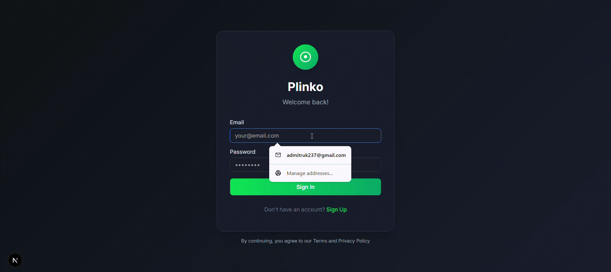

# Plinko Game

A provably fair Plinko game built with Next.js 16, React 19, and Feature-Sliced Design architecture.



## Tech Stack

| Layer | Technology |
|-------|-----------|
| Framework | Next.js 16 (App Router, RSC) |
| UI | React 19, shadcn/ui (`base-nova`), Tailwind CSS v4 |
| State | Zustand 5, TanStack Query 5 |
| Forms | react-hook-form + zod |
| Animation | motion/react, Canvas API |
| Auth | httpOnly cookies, JWT (access + refresh) |
| Language | TypeScript (strict) |

## Architecture

[Feature-Sliced Design](https://feature-sliced.design/) — imports flow downward only:

```
app       → routing, layout, BFF API proxy, SSR hydration
pages     → page-level compositions
widgets   → complex UI blocks (game-client, game-board, game-sidebar)
features  → interactive features (auth, place-bet, bet-mode, bet-history)
entities  → Zustand stores (session, game, settings)
shared    → UI components, utils, API client
```

## Game Flow

1. Player sets stake, rows (8–16), and risk (LOW / MEDIUM / HIGH)
2. `POST /api/bets` → backend returns `path` (binary L/R string) + `bucketIndex` + `multiplier`
3. Canvas animates the ball along the path in real time
4. Balance updated optimistically via `queryClient.setQueryData(['me'])`
5. Multiple balls can be in flight simultaneously (auto-bet mode)

## Getting Started

```bash
npm install
npm run dev       # dev server → http://localhost:3000
npm run build     # production build
npm run start     # production server
npm run lint      # ESLint check
npm test          # Jest test suite
```

## Environment

| Variable | Description |
|----------|-------------|
| `API_BASE_URL` | Backend URL (default: `https://plinko-be-stanish.fly.dev`) |

No `NEXT_PUBLIC_` prefix — the backend URL is server-only, accessed only from BFF route handlers.

## Project Structure

```
src/
  app/
    api/          ← BFF proxy (auth, bets, game/config, seeds, user/me)
    providers/    ← QueryProvider, SessionProvider, SettingsProvider
    game/         ← protected game page
    history/      ← bet history page
    login/        ← public auth pages
    register/
  entities/
    session/      ← auth state (accessToken + user)
    game/         ← isPlaying flag, BallAnimation type
    settings/     ← sound + animations toggles (persisted to cookies)
  features/
    auth/         ← login/register Server Actions, zod schemas, forms
    game/         ← useGamePlay: bet → animation Promise → result → balance
    place-bet/    ← useBetForm (BigInt), useAutoBet loop
    bet-history/  ← infinite query with cursor-based pagination
    game-settings/← sound/animation settings dialog
  widgets/
    game-client/  ← main game layout, orchestrates all game hooks
    game-board/   ← Canvas Plinko board (ball animation via path string)
    game-sidebar/ ← stake form, risk/rows selectors, auto-bet settings
    history-client/ ← filter + infinite scroll bet table
    bottom-nav/   ← mobile tab bar with animated indicators
    header/       ← reusable page header
  shared/
    ui/           ← shadcn/ui components
    api/          ← bffApi client, auth.api (server-only)
    lib/          ← credits (BigInt), session, auth-proxy, utils
    config/       ← constants, routes
```

## Credits / Monetary Values

All monetary values are **integer strings** (e.g. `"1000000"` = 1.00 credit, 6 decimal places).

```ts
import { parseCredits, formatCredits } from '@/shared/lib/credits'

parseCredits('1.00')    // → 1_000_000n (BigInt)
formatCredits('1000000') // → '1.00'
```

Never use `Number()` or `parseFloat()` for bet amounts — precision loss.

## Auth

- Tokens live in **httpOnly cookies** — browser never accesses them directly
- `accessToken` (short-lived) + `refreshToken` (long-lived)
- Middleware (`src/proxy.ts`) guards routes via `refreshToken` cookie only (no backend call)
- Session hydrated server-side on every request via `GET /api/auth/session`
